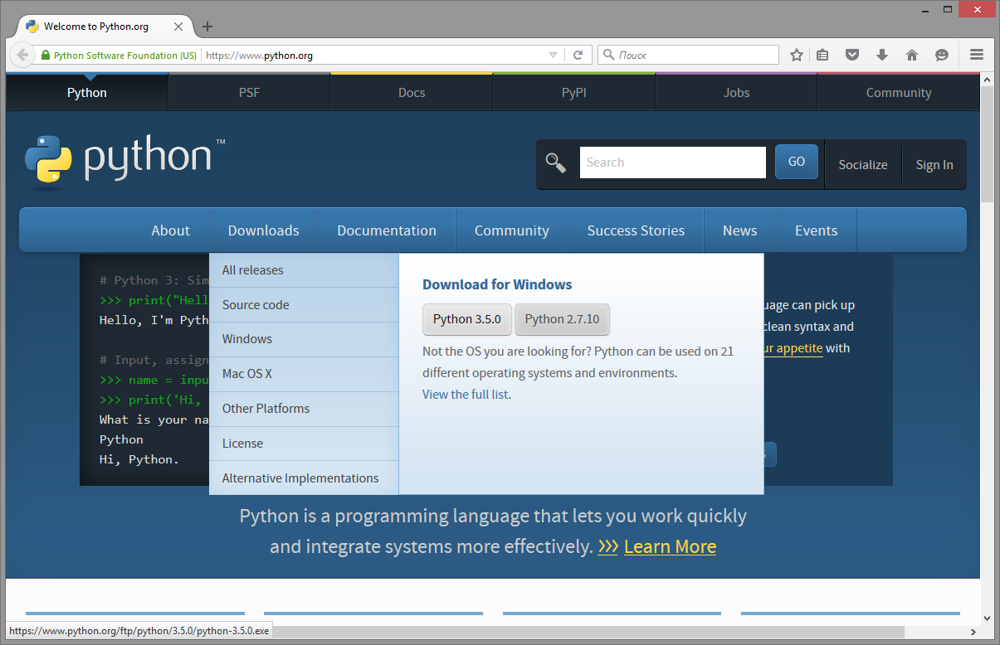
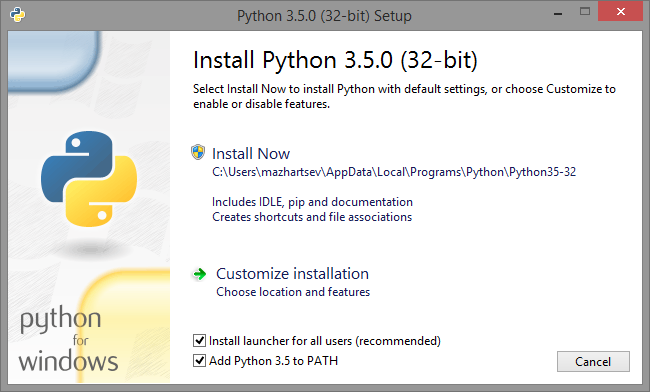
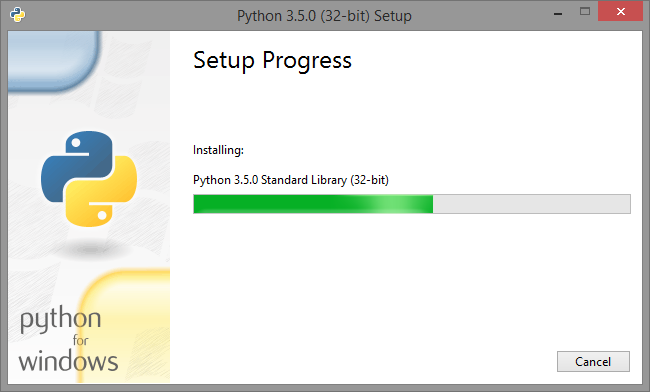
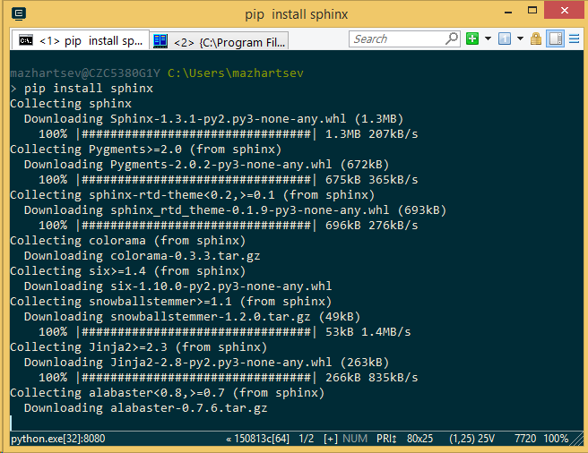

========================================
Быстрый старт
========================================

Sphinx доступен для всех основных операционных систем,  которые поддерживает язык программирования Python.

Установка Windows
~~~~~~~~~

Приступим к установке Sphinx, достаточно выполнить ряд действий описанных ниже:

1. Скачайте установочный файл интерпретатора языка программирования Python версии ``3.5`` -- https://www.python.org.

|Установка1| 
	   
2. Запустите файл установки. На первом шаге поставьте галочку напротив **Add Python 3.5 to PATH** и нажмите **Install Now**.

|Установка2|

3. Дождитесь завершения установки интерпретатора.

|Установка3|
	   
4. После установки интерпретатора необходимо установить модуль Python Sphinx, для этого откройте командную строку *Пуск > cmd* и выполните команду ``pip install sphinx``.

|Сфинкс|
	   
На этом установка Python Sphinx закончена, можно переходить к сборке документации. Сборка осуществляется командой:

::

	sphinx-build -b html папка\с\исходными_файлами папка\для\сконвертированных_файлов
	
Например:

::

	sphinx-build -b html source build\html
	
	   
Другие способы установки описаны в разделе `Installing Sphinx <http://sphinx-doc.org/latest/install.html>`_ официальной документации Sphinx.

Создание нового проекта
~~~~~~~~~~~~~~~~~~~~~~~

Создадим директорию для нового проекта и перейдем в неё. Для этого в ОС Linux необходимо выполнить следующие команды в терминале:

.. code-block:: python
    
    mkdir MyProject
    cd MyProject/

Для инициализации проекта необходимо выполнить команду ``sphinx-quickstart`` : 

.. code-block:: python
    
    sphinx-quickstart
    
Программа задаст ряд вопросов. Все настройки можно будет позже изменить в файле ``conf.py``.

.. code-block:: python

     > Корневой каталог документации. По умолчанию текущий каталог.
     > Root path for the documentation [.]: 
     
     > Сделать ли раздельные папки исходников и готовых страниц - Да
     > Separate source and build directories (y/N) [n]: y
     
     > Префикс для директорий с шаблонами и статическими файлами.
     > Name prefix for templates and static dir [_]: 
     
     > Название проекта. Для начала лучше вводить на латинице.
     > Project name: 
     
     > Имя автора/авторов. Для начала лучше вводить на латинице.
     > Author name(s):
     
     > Версия проекта
     > Project version:
     
     > Номер релиза проекта
     > Project release [1]:
     
     > Расширение исходного файла. По умолчанию .rst.
     > Source file suffix [.rst]:
             
     > Имя мастер-документа. По умолчанию index.rst.
     > Name of your master document (without suffix) [index]:
     
     > Генерировать ePub версию документации?
     > Do you want to use the epub builder (y/n) [n]: 

     > Автоматически вставлять docstrings из модулей
     > autodoc: automatically insert docstrings from modules (y/n) [n]: 
     
     > 
     > doctest: automatically test code snippets in doctest blocks (y/n) [n]:
     
     > 
     > intersphinx: link between Sphinx documentation of different projects (y/n) [n]: 

     > 
     > todo: write "todo" entries that can be shown or hidden on build (y/n) [n]: 
     
     > 
     > coverage: checks for documentation coverage (y/n) [n]: 
     
     > Использовать модуль pngmath для вставки формул в формате png
     > pngmath: include math, rendered as PNG images (y/n) [n]:
     
     > Использовать модуль mathjax для вставки формул в формате MathJax
     > mathjax: include math, rendered in the browser by MathJax (y/n) [n]: y
     
     > 
     > ifconfig: conditional inclusion of content based on config values (y/n) [n]: 
     
     > 
     > viewcode: include links to the source code of documented Python objects (y/n) [n]: 

     > Создать Makefile - да
     > Create Makefile? (y/n) [y]: 

     > Сделать ли файл .bat, - нет, если у вас Linux
     > Create Windows command file? (Y/n) [y]: n ()

После ответа на вопросы будут созданы файлы ``index.rst``, ``conf.py``, ``Makefile``, ``_build``, ``_static``, ``_templates``.
::
    
    .
    ├── Makefile
    ├── _build
    ├── _templates
    ├── _static
    ├── conf.py
    └── index.rst

**Makefile** — содержит инструкции для генерации результирующего документа командой make.

**_build** — директория, в которую будут помещены файлы в определенном формате после того, как будет запущен процесс их генерации.

**_static** — в эту директорию помещаются все файлы, не являющиеся исходным кодом (например, изображения). Позже создаются связи этих файлов с директорией build.

**conf.py** — содержит конфигурационные параметры Sphinx, включая те, которые были выбраны при запуске sphinx-quickstart в окне терминала.

**index.rst** — это корень проекта. Он соединяет документацию воедино, если она разделена на несколько файлов [#]_ .

.. [#] `IBM developerWorks Россия: Простое и удобное создание документации в Sphinx <http://www.ibm.com/developerworks/ru/library/os-sphinx-documentation/>`_

Файл index
~~~~~~~~~~

В каталоге проекта находится файл ``index.rst``, который  служит для объединения всех файлов в один проект. ``index.rst`` имеет достаточно простую структуру. Если открыть ``index.rst`` в простом текстовом редакторе, то будет отображено примерно следующее содержание:
::
    
   .. 3 documentation master file, created by
   sphinx-quickstart on Fri Dec 26 19:44:30 2014.
   You can adapt this file completely to your liking, but it should at least
   contain the root `toctree` directive.

    Welcome to 3's documentation!
    =============================
    
    Contents:
    
    .. toctree::
       :maxdepth: 2
    
    
    
    Indices and tables
    ==================
    
    * :ref:`genindex`
    * :ref:`modindex`
    * :ref:`search`

Первый абзац, который начинается с двух точек, содержит комментарий. Две идущие подряд точки ``..`` перед абзацем означают комментарий. Также они служат объявлением многих команд.

Подробнее синтаксис разметки рассматривается в следующих главах, а пока рассмотрим директиву ``.. toctree::``. Данная директива объединяет отдельные файлы в единый проект. 

Содержимое ``index.rst`` не должно включать много информации и в нём обязательно должна присутствовать директива ``.. toctree::``.

Чтобы включить в проект другие файлы, необходимо прописать названия этих файлов в ``.. toctree::``. Для примера создадим в корне проекта файл ``example1.rst`` и ``example2.rst`` со следующим содержанием:
::
    
    Это пример
    ==========

Теперь включим их в проект в файле ``index.rst``, добавив названия файлов к директиве ``.. toctree::``.
::
    
    Оглавление:
    
    .. toctree::
       :maxdepth: 2
       
       example1
       example2

