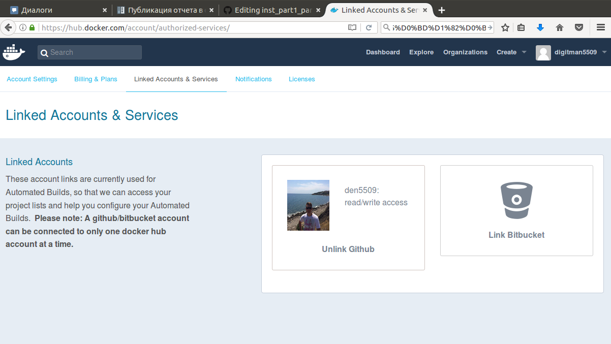
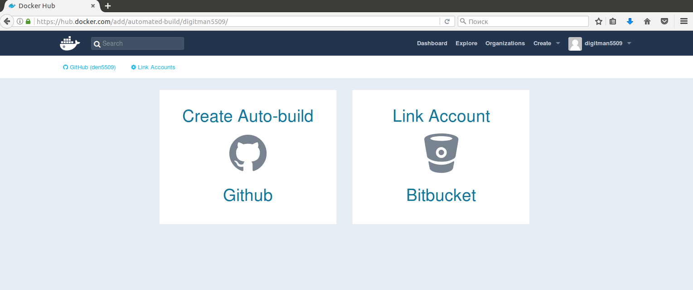
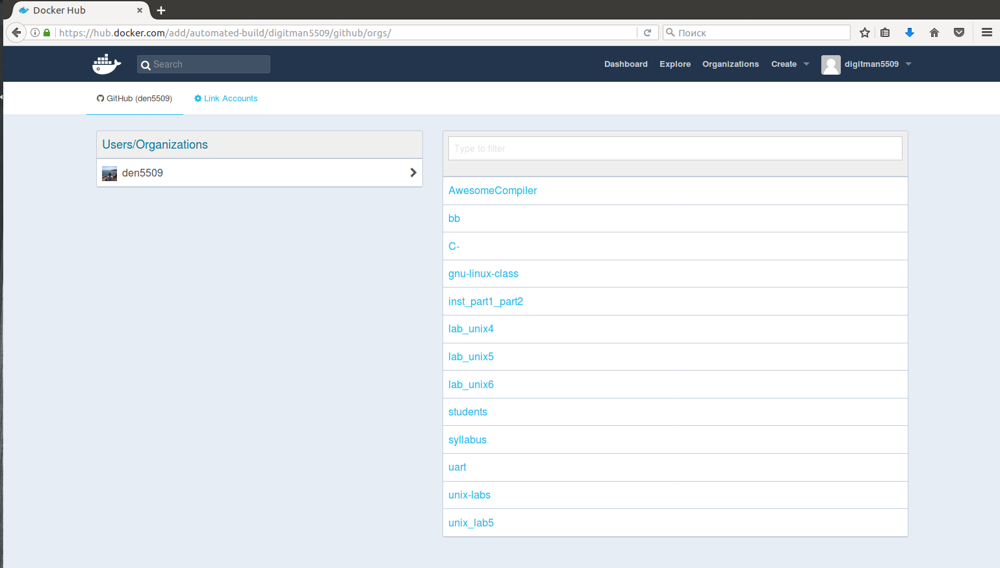
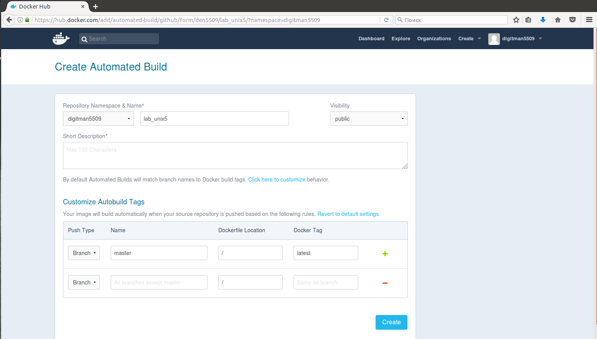
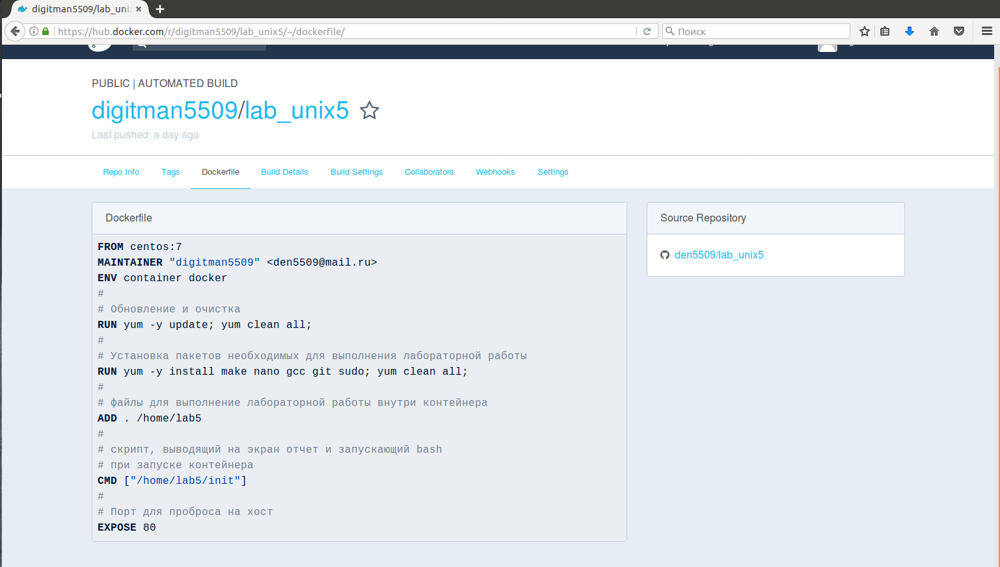
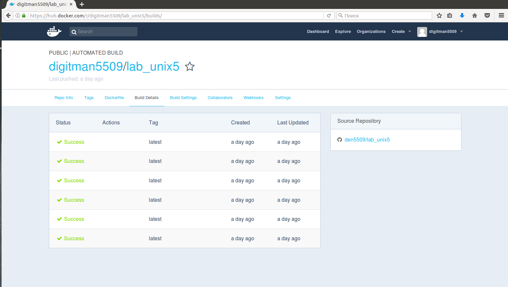
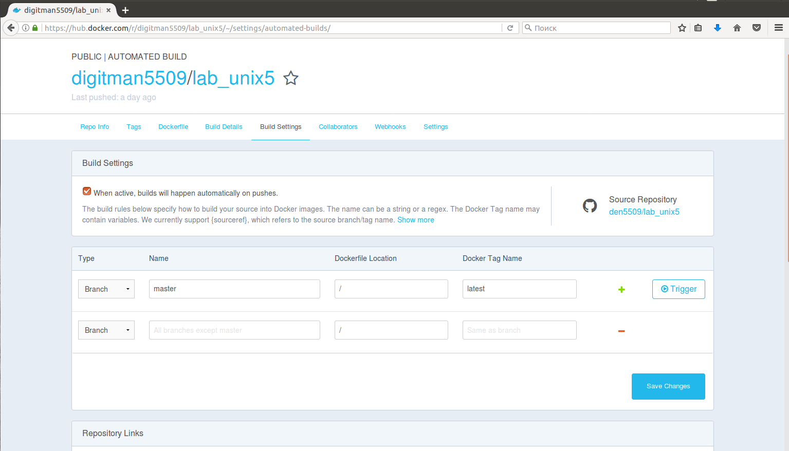

========================================
Автоматическая сборка Контейнера
========================================

Настройка аккаунта
~~~~~~~~~~~~~~~~~~~~~~~~~~~~~~~~

Автоматическая сборка и обновление образов из GitHub, непосредственно на Docker Hub. Эта функция работает посредством добавления commit hook вашего GitHub репозитория, вызывая сборку и обновление когда вы делаете выгрузку коммита (push).

Создайте на `Docker Hub <http://hub.docker.com>`_. аккаунт и авторизуйтесь.

Для построения автобилда необходимо привязать аккаунт Github. Это можно сделать следующим образом: нужно нажать на ``Setings`` и выбрать ``Linked Accounts & Services`` ну а дальше выбираете GitHub и вводите логин и пароль.

|Привязка аккаунта GitHub|

Рис.1 Привязка аккаунта GitHub

Импорт проекта
~~~~~~~~~~~~~~~~~~~~~~

Нужно нажать на ``Create`` и выбрать его списка доступных ``Create Automated Build``. Далее нажать ``Create Auto-build GitHub``. А там уже выбрать необходимый репозиторий с лабораторной из списка.

|Выбор GitHub проекта|

Рис 2. Выбор GitHub проекта

Импорт проекта
~~~~~~~~~~~~~~~~~~~~~~

Нужно нажать на ``Import a Project`` и выбрать его списка доступных. Либо, нажав на кнопку ``Import Manually`` вставить ссылку на него в поле c URL репозитория. Далее написать название и нажать ``Вперед``

|Выбор репозитория с лабораторной работой|

Рис 3. Выбор репозитория с лабораторной работой

Параметры автобилда
~~~~~~~~~~~~~~~~~~~~~~

Часть параметров будет заполнена автоматически, а часть нужно будет заполнить самому. Например ``Short Description`` тут необходимо дать краткий комментарий на тему что это вообще такое. Далее нажать на ``Click here to customize`` и тут прописать адрес по которому лежит ваш Dockerfile. Лучше его расположить в корне репозитория.

|Параметры автобилда|

Рис 4. Параметры автобилда

После этого нажимаем ``Create`` и получаем репозиторий с контейнером. Тут можно посмотреть как выглядит  Dockerfile перейдя по соответствующей ссылке ``Dockerfile``. После создания, начинается автоматическая процедура сборки, она обычно длится в течении 8 минут, но это зависит от того сколько разных действий прописано в Dockerfile.

|Вид докерфайла|

Рис 5. Вид докерфайла

Процесс сборки
~~~~~~~~~~~~~~~~~~~~~~~~

После создания репозитория можно перейти на вкладку ``Build Details`` тут можно смотреть процесс сборки контейнера, и увидеть места в которых возмжно возникла ошибка. Синхронизация с GitHub будет оставаться активной. Тоесть при изменениях на GitHub у вас будет обновляться сборка.

|Мониторинг сборок|

Рис 6. Мониторинг сборок

Настройки сборок
~~~~~~~~~~~~~~~~~~~~~~~~

После успешной или не успешной сборки можно подкорректировать её настройки, например если поменялось место расположения Dockerfile то необходимо перейти в ``Build Settings`` и прописать новый путь. После чего сборка автоматически обновится, и будет создана заново.

|Настройки сборок|

Рис 7. Настройки сборок

