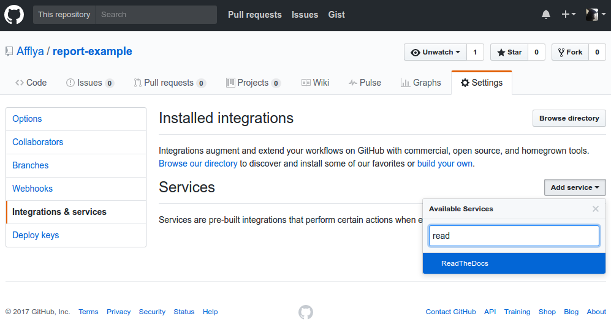

========================================
Подготовка репозитория на GitHub
========================================

Создание репозитория
~~~~~~~~~~~~~~~~~~~~

Создадим репозиторий на GitHub-е с названием ``report-example`` и загрузим в него созданный ранее проект Sphinx.

Подробнее о том, как это сделать написано в разделе :ref:`git`

Настройка репозитория
~~~~~~~~~~~~~~~~~~~~~

Чтобы при изменении репозитория на GitHub-е происходила автоматическая перегенерация отчета в службе ``Read the Docs`` следует добавить эту службу в настройках репозитория.

Для этого нужно перейти в репозитории во вкладку ``Settings`` и выбрать вкладку ``Integrations & services``. Далее, нажам на ``Add service`` добавить службу ``ReadTheDocs``.

|Добавление сервиса ReadTheDocs|

Рис. Добавление сервиса ReadTheDocs

