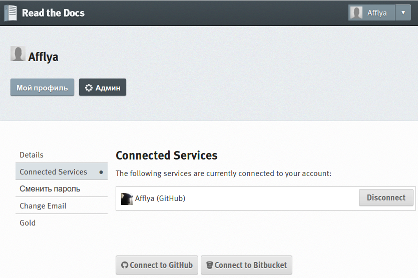
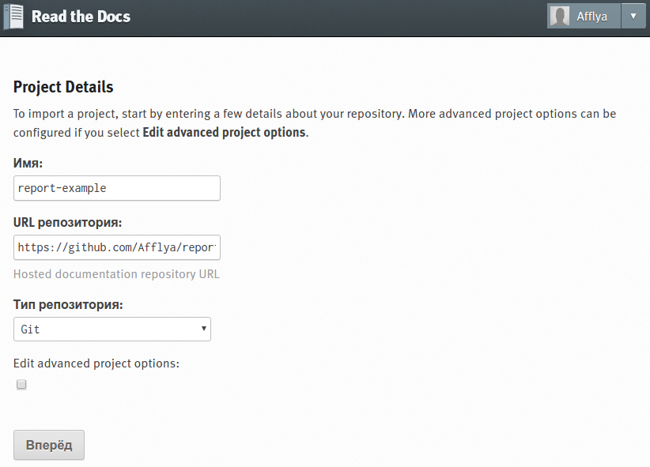
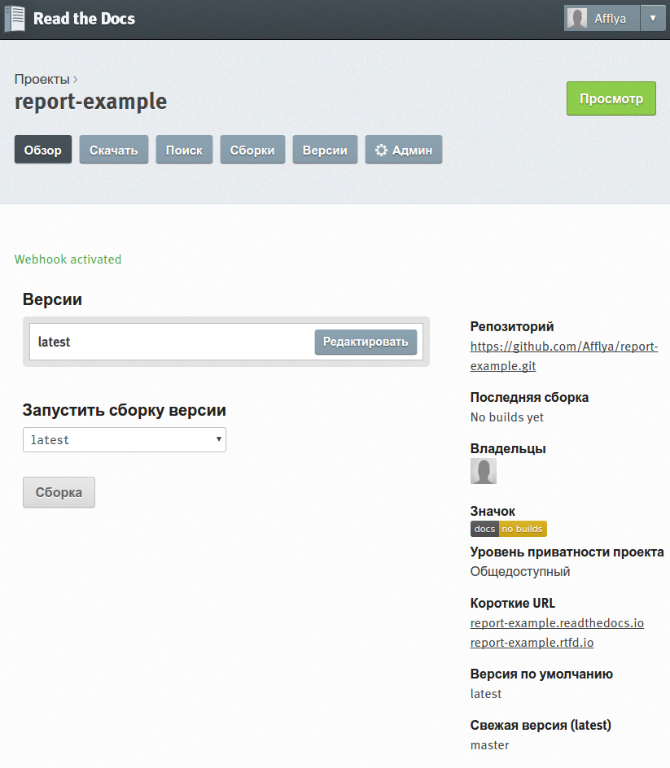
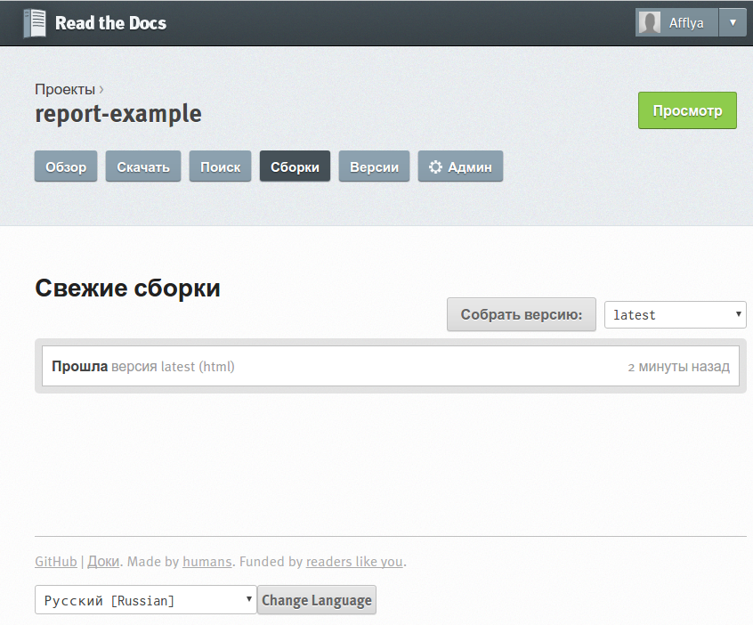
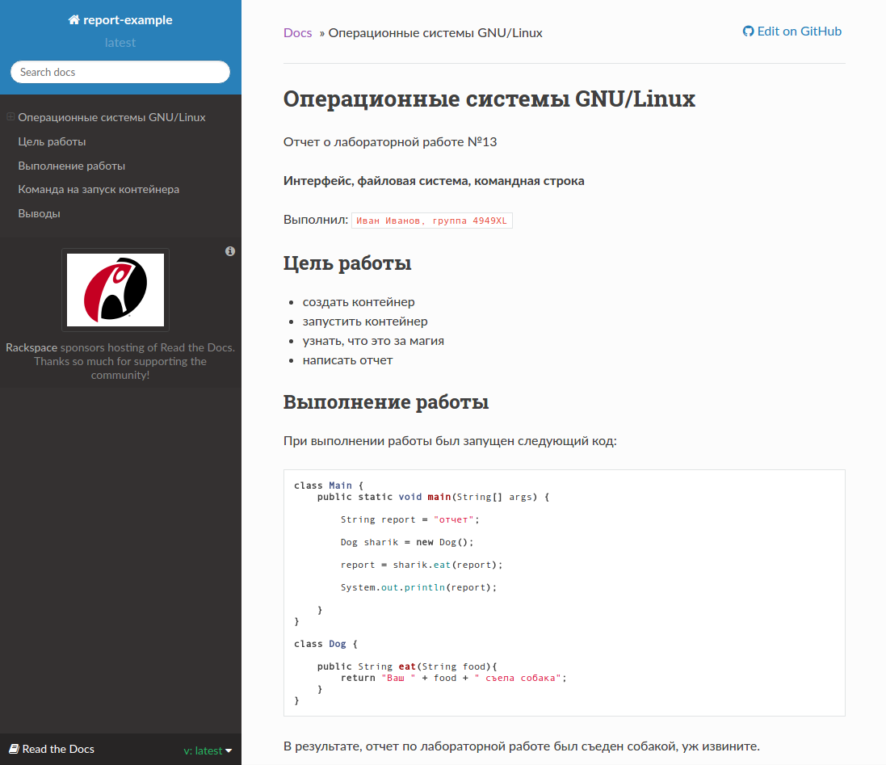

========================================
Публикация отчета в службе Read the Docs
========================================

Настройка аккаунта Read the Docs 
~~~~~~~~~~~~~~~~~~~~~~~~~~~~~~~~

Сначала нужно создать аккаунт на сайте `Read the Docs <http://.readthedocs.io>`_.

Для удобства также следует привязать аккаунт GitHub к аккаунту Read The Docs.

|Привязка аккаунта GitHub|

Рис.1 Привязка аккаунта GitHub

Импорт проекта
~~~~~~~~~~~~~~~~~~~~~~

Нужно нажать на ``Import a Project`` и выбрать его списка доступных. Либо, нажав на кнопку ``Import Manually`` вставить ссылку на него в поле c URL репозитория. Далее написать название и нажать ``Вперед``

|Импорт проекта|

Рис 2. Импорт проекта

Сборка проекта
~~~~~~~~~~~~~~~~~~~~~~

Сборка начнется автоматически. Наблюдать за её состоянием можно во вкладке ``Сборки``.

|Окно проекта|

Рис 3. Окно проекта

|Состояние сборки|

Рис 4. Состояние сборки

Результат сборки проекта
~~~~~~~~~~~~~~~~~~~~~~~~

После успешной сборки проекта, его можно будет открыть нажав на кнопку ``Просмотр``

|Результат сборки|

Рис 5. Результат сборки

